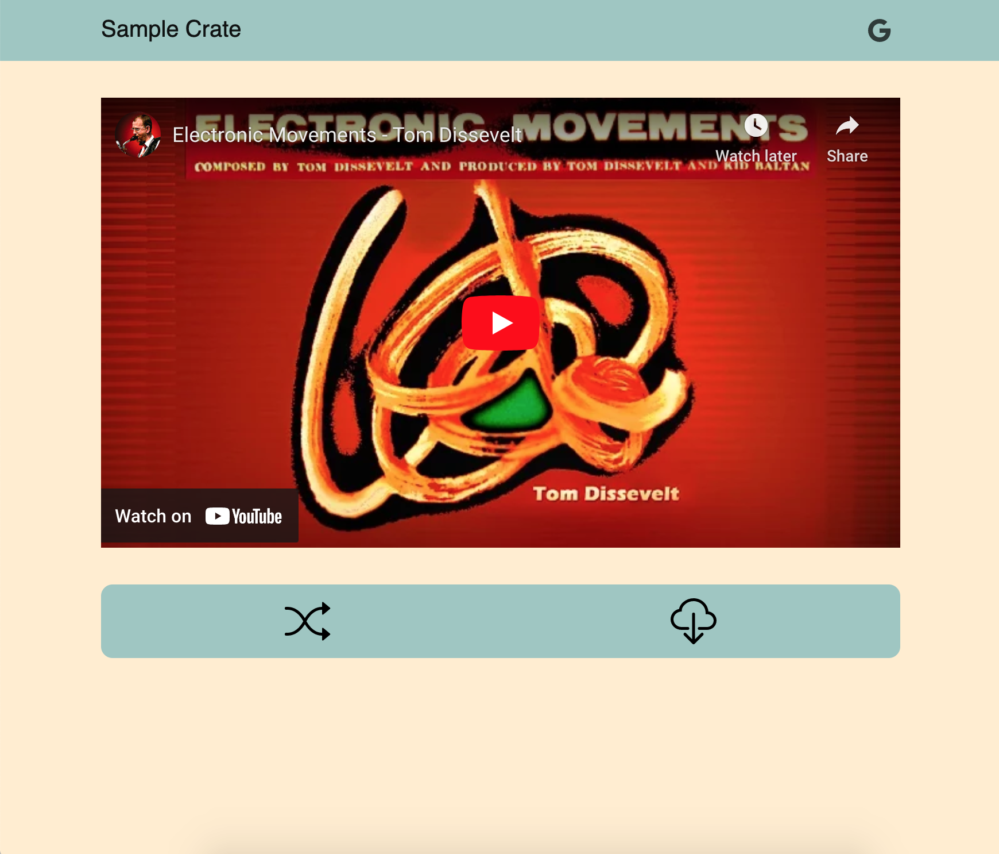
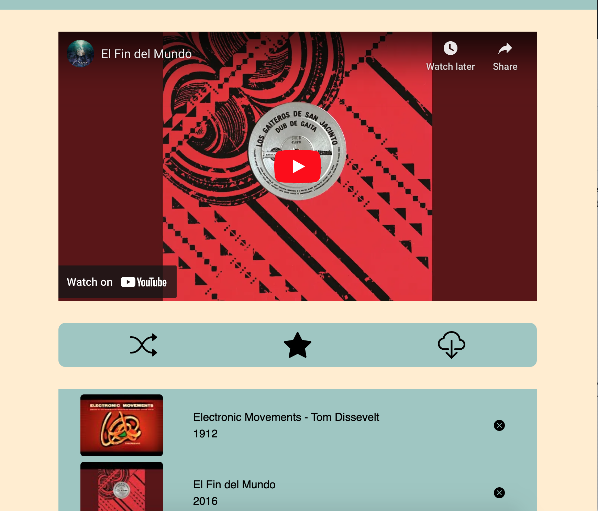
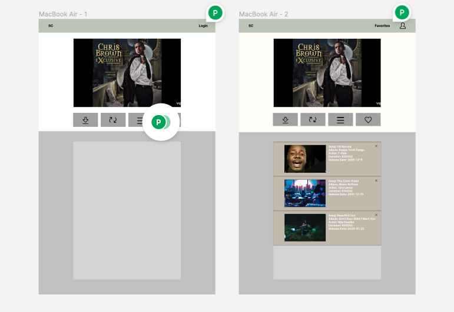

# Sample Crate

#### A site made to emulate going to the record store to dig through records to sample. Random songs are suggested for the user to sample with an easy link for mp3 download. Option available to sign-in with Google authentication allowing users to favorite songs.

##  Deployed Link
[Sample Crate](https://sample-crate.web.app/)
- Site may take some time to load (~30 sec) due to server hosting site
- If API quota is exceeded, the site will fail to get a new video and be unable to download

## Table of Contents
- [Deployed Link](#deployment)
- [Technologies Used](#technologiesused)
- [Features](#features)
- [Figma](#figma)
- [Trello](#trello)
- [Resources](#resources)
- [Future Implementations](#futureimplementations)

##  Technologies Used
- TypeScript
- React.js
- MongoDB
- Firebase Authentication
- HTML
- CSS
- React-Bootstrap
- YouTube API
- Discogs API
- T-One Youtube Converter API

##  Features
- Songs are randomly generated for users to sample
- Download link available to get quick access to MP3 file 
- Optionally, users can login using their Google account which allows them to also create a playlist of songs

##  Figma
- [Figma](https://www.figma.com/file/rhWX4Cpeom5hUfnexIlxmw/Sample-Crate?node-id=0%3A1&t=GsAnzm2cii1ry6w8-0)

##  Trello
- [Trello](https://trello.com/b/CYjq8Msl/sample-crate)

##  Resources:
- [MDN](https://developer.mozilla.org/en-US/)
- [StackOverflow](https://stackoverflow.com/)
- [TypeScript](https://www.typescriptlang.org/docs/)
- [React](https://reactjs.org/docs/getting-started.html)
- [Firebase](https://firebase.google.com/docs)
- [Discogs API](https://www.discogs.com/developers/#)
- [YouTube API](https://developers.google.com/youtube/v3/getting-started)
- [T-one YouTube Converter API](https://rapidapi.com/tuttotone/api/t-one-youtube-converter/)
- [React-Bootstrap](https://react-bootstrap.github.io/)

##  Future Implementations:
- Filter song by genre & year 
- Song History
